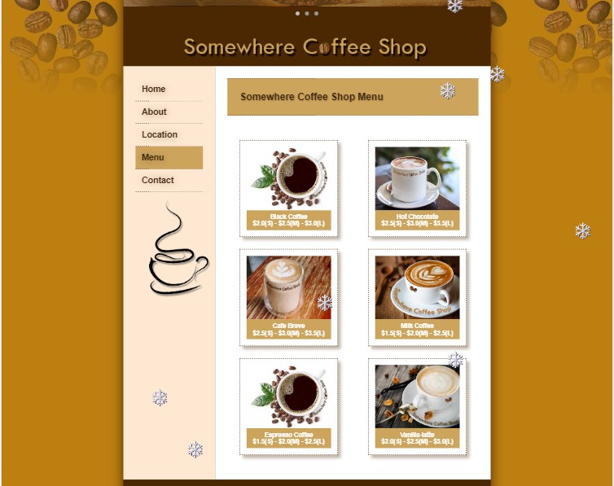
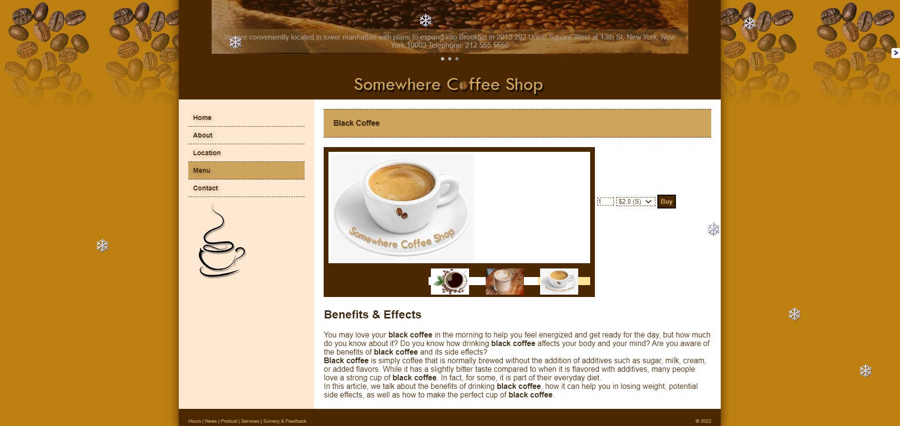
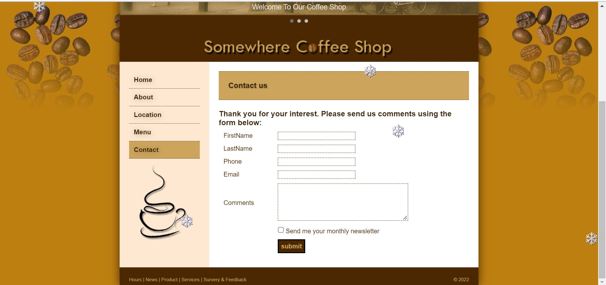
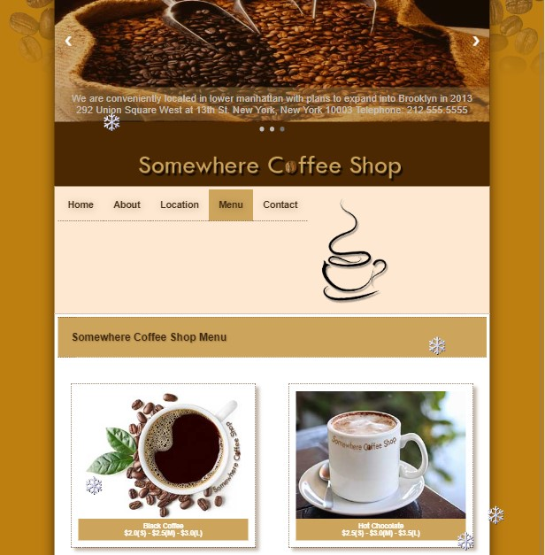
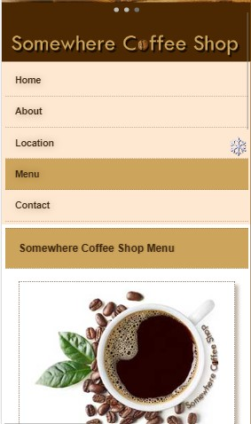

## Somewhere-Coffee-Shop

This is the project that I made after learning: html, css and javascript. Link website [here](https://uit-20521888.github.io/Somewhere-Coffee-Shop/)

### Screenshots
--------------------------------
Let's take a look at some website interfaces

#### Menu coffee
Where we will choose the type of coffee to drink

After choosing the type of coffee to drink. We will go to the page of each of those coffees to order.

--------------------------------------------------------

In addition, the project is also compatible on devices: Labtop, ipad, smartplone:
- Labtop 

- Ipad

- smartplone
